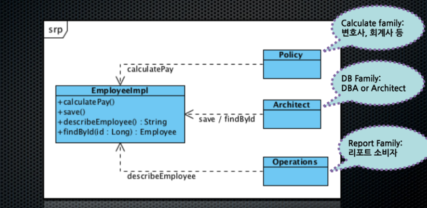
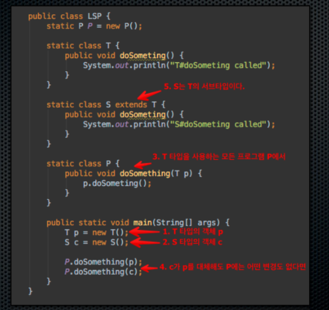
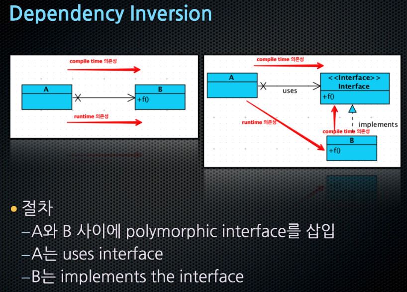

# SOLID 

## Single responsibility principle

한 클래스는 하나의 책임만 가져야 한다. 

## Open/closed principle

확장에는 열려있으나 변경에는 닫혀 있어야 한다.

## Liskov subsitution principle

상위 타입의 객체를 하위 타입의 객체로 치환해도 
상위 타입을 사용하는 프로그램은 정상적으로 동작해야 한다.

## Interface segregation principle
특정 클라이언트를 위한 인터페이스 여러 개가 범용 인터페이스 하나보다 낫다.
 
## Dependency inversion principle
구체화에 의존하면 안되고 추상화에 의존해야 한다.

