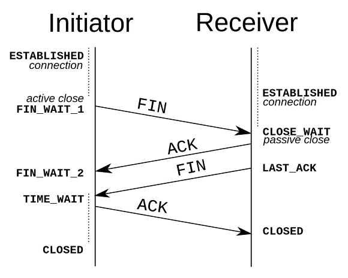

# TCP / IP

## 어플리케이션 계층
어플리케이션 프로토콜를 정의한다. 

## 트랜스포트 계층
컴퓨터로 들어온 데이터를 어떤 서비스 (어플리케이션 계층)에게 토스 할 지 **포트**를 보고 판단한다.

트랜스포트 계층에서 사용하는 대표적인 프로토콜은 TCP와 UDP가 있다.

### 3 Way Handshake
연결을 하여, 데이터를 전송하기 위해서 TCP는 3 Way Hanshaking이라는 과정을 거친다. 

1) 상대에게 통신을 하고 싶다는 메시지를 보낸다. (SYN)
2) 상대는 그 메시지에 대한 응답 + 나도 통신 준비가 되었다는 메시지를 보낸다. (SYN-ACK)
3) 2번에서 받은 메시지에 응답을 보낸다. (ACK)

> * SYN(Synchronization) : 연결요청, 세션을 설정하는데 사용되며 초기에 시퀀스 번호를 보냄 
> * ACK(Acknowledgement) : 보낸 시퀀스 번호에 TCP 계층에서의 길이 또는 양을 더한 것과 같은 값을 ACK에 포함하여 전송

### 4 Way Handshake
연결 종료를 위한 4 Way Handshaking이라는 과정을 거친다.

1. 클라이언트가 연결을 종료하겠다는 **FIN** 플래그를 전송한다.
2. 서버는 일단 확인메시지를 보내고 자신의 통신이 끝날때까지 기다리는데 이 상태가 **TIME_WAIT** 상태
3. 서버가 통신이 끝났으면 연결이 종료되었다고 클라이언트에게 **FIN** 플래그를 전송
4. 클라이언트는 확인했다는 메시지를 보냄

> * FIN(Finish) : 세션을 종료시키는데 사용되며 더 이상 보낸 데이터가 없음을 표시

## 네트워크 계층
IP 프로토콜이란 호스트에서 호스트까지의 통신, 즉 보내는 컴퓨터에서 받는 컴퓨터까지의 통신을 책임지는 프로토콜입니다.

IP는 UDP 와 같이 비연결형 형태입니다. 

신뢰성있는 프로토콜은 ICMP가 있습니다.

